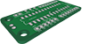
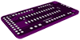
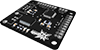

-------------

# Introduction

**SparkyJr.** is a programmable RGB LED mod companion light up activation controller for arcade pushbuttons on gaming fightsticks.

The hardware is based on AVR microcontrollers and programmed via [AVR Studio](http://www.atmel.ca/microsite/atmel_studio6/) or the [Arduino IDE](http://arduino.cc/en/Main/Software)

**<span style="color:red">*note:*</span> please use Arduino IDE 1.0.6**


**SparkyJr.** in it's entirety is open source. Including hardware design, software implementation and libraries
***
##Software
#### Arduino

**SparkyJr.** Arduino based files are located in the *[arduino](https://github.com/32teeth/SparkyJr/tree/gh-pages/arduino/Sparky)* folder

This includes all the files required to upload to your specific AVR chipset.

**SparkyJr** only has one library dependency. We make use of the [EEPROMx](https://github.com/autohome/autohome-arduino/tree/master/libraries/EEPROMx) library

*for help on installing libraries into the Arduino IDE, please visit the [how to](http://arduino.cc/en/Guide/Libraries) on the Arduino site

#### Processing
**SparkyJr.** Processing based files are located in the *[processing](https://github.com/32teeth/SparkyJr/tree/gh-pages/processing)* folder

This includes all the files required to run the configurator.

#### Google Chrome App
**SparkyJr.**'s configurator is additionally available as a Google Chrome Application and is available unpackaged in the [google](https://github.com/32teeth/SparkyJr/tree/gh-pages/google) folder

***
##Hardware
#### Eagle CAD
All of the PCB design, schema and board layout files where designed in [CadSoft's Eagle Cad PCB](http://www.cadsoftusa.com/eagle-pcb-design-software/product-overview/?language=en) software.

The .sch and .brd files are available in the [eagle](https://github.com/32teeth/SparkyJr/tree/gh-pages/eagle) folder.

####SparkyJr. hardware variants
*all versions are currenlty supported in the new SparkyJr software and configurator*

|  v1 | v2 (pwm)  | v3 (ftdi) (32u4)  | *v4* (current)  | v4 (expansion) |
|---|---|---|---|---|
|retired|retired|deprecated|current release|expansion board|
|   |   |   |   |   |
|   |   |  ftdi [sch](https://github.com/32teeth/SparkyJr/blob/gh-pages/eagle/SparkyJr_v4FTDI.sch) [brd](https://github.com/32teeth/SparkyJr/blob/gh-pages/eagle/SparkyJr_v4FTDI.brd) |  [sch](https://github.com/32teeth/SparkyJr/blob/gh-pages/eagle/SparkySpecialK.sch) [brd](https://github.com/32teeth/SparkyJr/blob/gh-pages/eagle/SparkySpecialK.brd) | [sch](https://github.com/32teeth/SparkyJr/blob/gh-pages/eagle/SparkySpecialKExpansion.sch) [brd](https://github.com/32teeth/SparkyJr/blob/gh-pages/eagle/SparkySpecialKExpansion.brd)  |
|   |   |  32u4 [sch](https://github.com/32teeth/SparkyJr/blob/gh-pages/eagle/SparkyJr_v432u4.sch) [brd](https://github.com/32teeth/SparkyJr/blob/gh-pages/eagle/SparkyJr_v432u4.brd) |   |   |

***
## Arduino


Start up your Arduino IDE and open **Sparky.ino**
The only file you *need* to change settings in is the [setup.h](https://github.com/32teeth/SparkyJr/blob/gh-pages/arduino/Sparky/setup.h) file

to identify your board to the SparkyJr software, simply uncomment the right line
the comments in the code indicate the proper name

```
/*
** @define (DRIVER|LEO|UNO|JOY|RAZER)
** @desc DRIVER = Arduino WS2811 Shield
** @desc LEO = Arduino Leonardo
** @desc SPARKY = SparkyJrFTDI
** @desc UNO = Arduino UNO
** @desc JOY = Arduino Joystick Shield
** @desc RAZER = Razer Atrox Arcade Stick
*/
#define DRIVER
//#define LEO
//#define SPARKY
//#define UNO
//#define JOY
//#define RAZER
```
to identify your RGB LED type to the SparkyJr software, simply uncomment the right line

```
/*
** @define (ANODE|CATHODE)
** @desc ANODE = Common Anode RGB LEDs
** @desc CATHODE = Common Cathode RGB LEDs
*/
#define ANODE
//#define CATHODE
```
Complie and Run!

***
## Processing


if you are on a Mac, you're in luck. There is a packaged application available for you. Simply download the [SparkyOfficial.app](https://github.com/32teeth/SparkyJr/tree/gh-pages/processing/SparkyOfficial/SparkyOfficial/application.macosx/SparkyOfficial.app) file

if you are looking to run the application from source, simply download Processing and run the [SparkyOfficial.pde](https://github.com/32teeth/SparkyJr/blob/gh-pages/processing/SparkyOfficial/SparkyOfficial/SparkyOfficial.pde) file

***
Should you run into any trouble, or have further questions, feel free to reach out.

[ 32teeth](https://www.facebook.com/32teeth)

[ eugeneyevhen](https://twitter.com/eugeneyevhen)

[ SparkyJr](32teeth.github.io/SparkyJr)

[ 32teeth](http://ca.linkedin.com/in/32teeth)

***
# Thanks